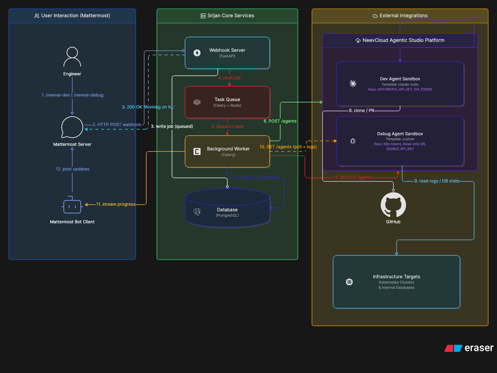
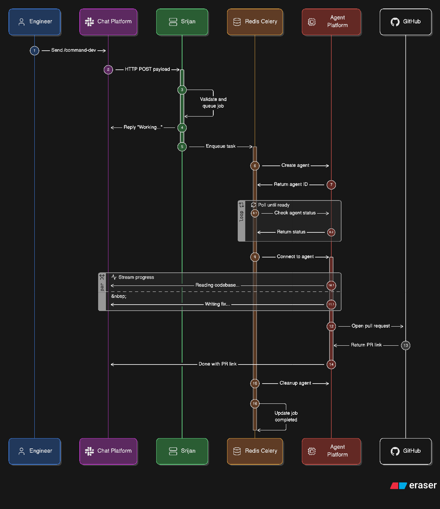
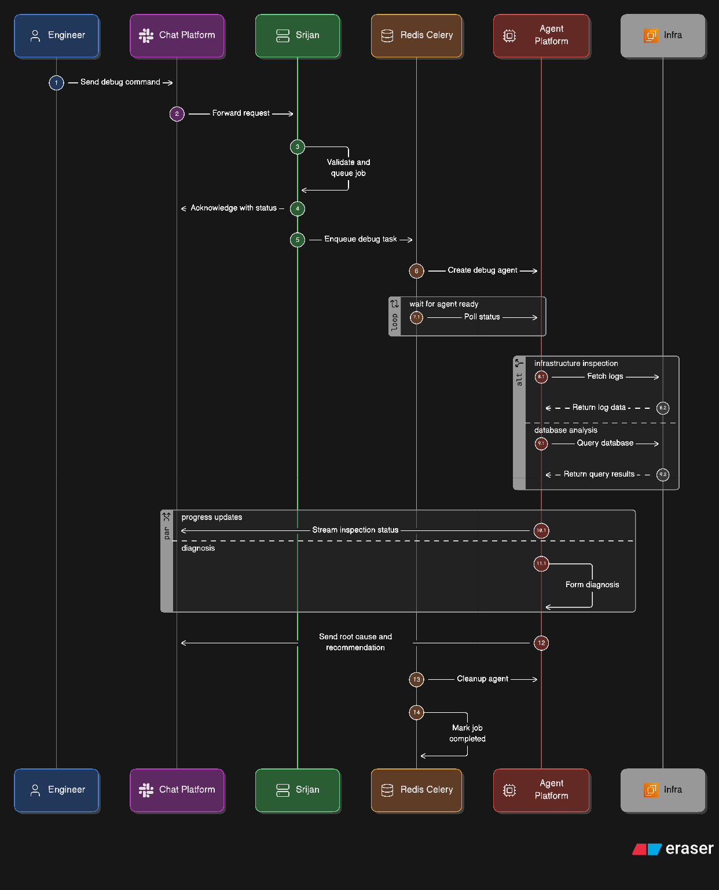

## **SRIJAN** 

## Design Document 

───────────────────────────────── 

An AI-Powered Engineering Assistant for Chat Platforms 

**Version:** 1.0 

 

## **1. Problem Statement** 

Engineering teams that operate AI-powered platforms face a recurring productivity problem: routine, well-bounded tasks such as small code fixes, first-pass bug investigations, and platform health checks require engineers to fully context-switch out of their primary collaboration tool, manually set up a local environment, and drive the investigation themselves, even when the task is well-scoped enough for an autonomous AI agent to handle. 

## **This creates two compounding problems:** 

## **1.1 Engineer Productivity Loss** 

Every small engineering task forces a context switch: 

- The engineer leaves the team chat window 

- Sets up a local development environment or production access 

- Manually drives the investigation or code change 

- Returns to the chat window to report results 

Even a 15-minute task consumes 30–45 minutes of total time due to the overhead of switching environments, re-establishing context, and returning to the communication thread. At scale across a team of engineers and dozens of small tasks per week this represents a significant and unnecessary productivity drain. 

## **1.2 No Internal Platform Dogfooding** 

Teams that build agent platforms for external customers often have no internal use of their own platform. This creates a critical blind spot: SDK gaps, infrastructure limitations, and developer experience issues are discovered by paying customers before the building team encounters them themselves. There is no faster feedback loop than being your own first customer. 

## **Core Insight** 

Both problems share the same solution: a service that lets engineers delegate well-bounded tasks to an AI agent directly from their chat window, without ever leaving it while simultaneously serving as a live internal consumer of the agent platform itself. 

 

## **2. Goals / Non-Goals** 

## **2.1 Goals** 

The following outcomes define success for Srijan v1: 

||**Goal**|**Success Metric**|
|---|---|---|
|G1|Allow engineers to trigger AI coding tasks via a chat slash command without leaving the chat window|Engineer receives a PR link inside the chat thread within 10 minutes of sending the command|
|G2|Allow engineers to trigger AI debugging / investigation tasks via a chat slash command|Engineer receives a structured diagnosis report inside the chat thread|
|G3|Acknowledge every command within 3 seconds|100% of slash command requests receive an immediate "Working on it…" reply under 3 seconds|
|G4|Stream live progress updates to the chat thread while the agent works|Progress messages appear in the thread at least every 60 seconds during agent execution|
|G5|Serve as an internal consumer of the agent platform to surface SDK and infrastructure gaps early|At least one actionable platform issue identified per sprint from internal Srijan usage|
|G6|Maintain a full audit log of every task, its status, and its result|Every job stored in PostgreSQL with complete metadata, queryable at any time|

 

## **2.2 Non-Goals** 

The following are explicitly out of scope for Srijan v1 to keep the first release focused and deliverable: 

||**Non-Goal**|**Reason**|
|---|---|---|
|NG1|A web-based admin dashboard or UI for monitoring jobs|PostgreSQL + Mattermost thread updates provide sufficient visibility for v1; a dashboard is a v2 feature|
|NG2|Support for chat platforms other than the initially targeted platform|Integration is scoped to one chat platform in v1; multi-platform support is a future extension|
|NG3|Long-running autonomous agents (tasks > 15 minutes)|v1 focuses on well-bounded tasks; open- ended research agents are a different product category|
|NG4|Writing directly to production systems (all write operations are PR-based)|Srijan never pushes directly to main branches or modifies production data; all changes go through a review process|
|NG5|Natural language conversation / multi- turn dialogue with the agent|v1 is single-shot: one command → one task → one result; conversational agents are a v2 feature|
|NG6|User authentication or per-user permission management|v1 trusts the chat platform for authentication; fine-grained Srijan-level permissions are a future feature|

 

## **3. Implementation Plan** 

## **3.1 Overview** 

Srijan is a Python-based HTTP service that acts as the intelligent middleware between a team chat platform and an external AI Agent Platform. It enables engineers to delegate routine engineering tasks — coding fixes and first-pass debugging — to autonomous AI agents via simple slash commands, without leaving their chat window. 

**The core flow in one sentence:** A slash command arrives → Srijan acknowledges it instantly → a background worker provisions a sandboxed AI agent → the agent executes the task → Srijan streams progress and delivers the result back to the chat thread → the agent is safely destroyed. 

## **Design Principle — Platform Agnosticism** 

Srijan is designed as an open-source-compatible service. It treats both the chat platform and the agent platform as black boxes accessed only through their public APIs. No internal implementation details of either platform are assumed or relied upon. This means Srijan can be adapted to work with any chat system (Slack, Teams, Discord) and any agent platform that exposes a compatible REST API. 

## **Command Types** 

Srijan supports two slash commands in v1: 

|**Command**|**Purpose**|**Agent Type**|**Output**|
|---|---|---|---|
|/command-dev <task description>|Coding tasks — bug fixes, small features, documentation updates|Dev Agent (code- capable, repo access)|GitHub Pull Request link|
|/command-debug <issue description>|Troubleshooting — root cause analysis, log inspection, API diagnosis|Debug Agent (read- only cluster, DB, API access)|Structured diagnosis report|

## **3.2 Key Components** 

Srijan is composed of five core components that handle the complete lifecycle of a task: 

## **Component 1 — Webhook Server (FastAPI, Python)** 

**Role:** The entry point of the system. Receives all incoming slash commands from the chat platform. **Why FastAPI:** FastAPI's asynchronous (non-blocking) architecture allows the server to respond to the chat platform's 3-second timeout requirement instantly — replying "Working on it!" — while handing the actual task off to a background worker. Flask and Django do not handle this as cleanly without significant additional configuration. 

- Receives HTTP POST requests from the chat platform 

- Validates the request authenticity using a shared secret token 

 

- Returns an immediate acknowledgment response within 3 seconds 

- Persists the job record to PostgreSQL with status: queued 

- Enqueues the task to the Redis-backed Celery queue 

## **Component 2 — Task Queue (Celery + Redis)** 

**Role:** Decouples the fast acknowledgment from the slow agent execution. Acts as the reliable message buffer between the webhook server and the background workers. 

**Why Celery + Redis:** Celery is the industry-standard Python library for distributed task execution. Redis is an in-memory data store that acts as the task broker — extremely fast and reliable for queuing. Together they ensure tasks are never lost (even if a worker crashes) and can be automatically retried on failure. 

- Holds pending tasks in two separate queues: dev-queue and debug-queue 

- Routes tasks to the appropriate worker type 

- Automatically retries failed tasks up to 3 times with exponential backoff 

- Supports multiple concurrent workers for parallel task processing 

## **Component 3 — Background Worker (Celery Worker, Python)** 

**Role:** The execution engine of Srijan. Picks up queued tasks and drives the full agent lifecycle. 

- Calls the Agent Platform API to provision a sandboxed AI agent 

- Polls the agent status until it transitions to Ready 

- Streams progress updates to the chat thread via the bot account 

- Detects task completion and extracts the result (PR link or diagnosis text) 

- Posts the final result to the chat thread 

- Calls the Agent Platform API to delete or pause the agent 

- Updates the job record in PostgreSQL to status: completed or failed 

## **Component 4 — Database (PostgreSQL)** 

**Role:** The single source of truth for all Srijan state. Every job, agent reference, and log entry is persisted here. 

- **jobs table:** Stores every command received — user, channel, command text, status, timestamps, and final result 

- **agents table:** Links each job to its provisioned agent ID on the Agent Platform — needed for polling and cleanup 

- **logs table:** Full history of every progress message streamed from agents — complete audit trail 

## **Component 5 — Chat Bot Account** 

**Role:** Srijan's voice in the chat platform. Posts all outbound messages — acknowledgments, progress updates, and final results — back to the correct thread. 

- Dedicated bot account registered with the chat platform 

- Used exclusively for outbound messages — Srijan never reads chat messages proactively 

- Posts are threaded — all updates for a task appear in the same thread as the original command 

**3.3 High-Level Architecture Diagram** 

 

The diagram below illustrates the three logical zones of the Srijan architecture and how data flows between them: 

**Figure 1:** _Srijan high-level architecture — three logical zones_ 

 

## **3.4 APIs** 

Srijan interacts with two external API surfaces: the Chat Platform (inbound slash commands + outbound bot messages) and the Agent Platform (agent lifecycle management). 

## **3.4.1 Inbound API — Chat Platform Slash Commands** 

When an engineer types a slash command, the chat platform sends an HTTP POST to Srijan's webhook endpoint: 

Endpoints: POST /webhook/dev              → for coding tasks POST /webhook/debug            → for debugging tasks Headers: Content-Type: application/x-www-form-urlencoded Body (form fields): token       : <verification_token>    // shared secret for validation user_id     : <user_id>              // who triggered the command channel_id  : <channel_id>           // where to post results command     : /command-dev           // the slash command used text        : fix the login 404 bug  // the task description Response (must be within 3 seconds): HTTP 200 { "text": "Working on it... I'll update this thread." } 

 

## **3.4.2 Outbound API — Chat Bot Messages** 

Srijan posts messages back to the chat thread using the platform's bot API: 

Endpoint: 

POST <chat-platform-base-url>/api/v4/posts 

Headers: Authorization : Bearer <bot_token> Content-Type  : application/json 

Body: { "channel_id" : "<channel_id>", "root_id"    : "<original_post_id>",   // threads all replies together "message"    : "<progress_or_result>" } 

## **3.4.3 Agent Platform API — Agent Lifecycle** 

Srijan uses five Agent Platform API endpoints to manage the full agent lifecycle: 

|**Operation**|**Method + Endpoint**|**Purpose**|**When Called**|
|---|---|---|---|
|Create Agent|POST /agents|Provisions a new sandboxed agent from a template. Body contains template name, injected environment variables, and egress allow- list.|When a task is picked up by the Celery worker|
|Poll Status|GET /agents/{agent_id}|Returns current agent status: Provisioning → Ready → Failed. Srijan polls every 10 seconds until Ready or timeout.|Every 10 seconds after creation until Ready|
|Connect|POST /agents/{agent_id}/connect|Mints a short-lived connection token used to stream agent output over a PTY/exec connection.|Once agent status is Ready|
|Delete|DELETE /agents/{agent_id}|Permanently destroys the agent sandbox and releases all associated resources.|After task completes or fails, or on 15- min timeout|

 

|**Operation**|**Method + Endpoint**|**Purpose**|**When Called**|
|---|---|---|---|
|Pause|POST /agents/{agent_id}/pause|Suspends the agent sandbox to save compute costs without permanently deleting it.|Optional — for tasks that may need resuming|

## **3.4.4 Agent Credential Injection** 

Credentials are injected into the agent sandbox at creation time via the Create Agent API's environment variable array. They are never stored in Srijan's logs or codebase: 

|**Credential**|**Dev Agent**|**Debug** **Agent**|**Access Level**|
|---|---|---|---|
|ANTHROPIC_API_KEY|Yes|Yes|AI model access|
|GH_TOKEN|Yes (write)|Yes (read- only)|Dev: clone + open PR / Debug: read only|
|K8s Credentials|No|Yes|Read-only cluster token, short-lived|
|SIGNDZ_API_KEY|No|Yes|Platform API access (read-only)|
|DB Credentials|No|Yes|Database read-only access|

## **Security Note** 

All credentials are stored as environment variables on the Srijan server and injected at runtime. The egress policy on every agent is set to allow_list — each agent can only communicate with explicitly whitelisted external hosts. Dev agents may only reach the code repository host. Debug agents may only reach cluster endpoints and the database. A 15-minute hard timeout applies to all agents. 

 

## **3.5 Sequence Diagram** 

The sequence diagrams below illustrate the precise message flow for both command types. Time flows downward. Each numbered step corresponds to the implementation plan phases. 

## **3.5.1 /command-dev — Coding Task Flow** 

**Figure 2:** _Sequence diagram — /command-dev coding task_ 

 

## **3.5.2 /command-debug — Debugging Task Flow** 

**Figure 3:** _Sequence diagram — /command-debug investigation task_ 

 

## **4. Database Schema (PostgreSQL)** 

Three tables capture the full state and history of every Srijan task: 

## **Table: jobs** 

|**Column**|**Type**|**Description**|
|---|---|---|
|id|UUID (PK)|Unique job identifier, generated by Srijan on receipt|
|command_type|VARCHAR(10)|"dev" or "debug"|
|user_id|VARCHAR(128)|ID of the user who triggered the slash command|
|channel_id|VARCHAR(128)|Chat channel/thread where results should be posted|
|root_post_id|VARCHAR(128)|The original slash command post ID — for threading replies|
|task_text|TEXT|Full natural language task description from the command|
|status|VARCHAR(20)|queued | provisioning | running | completed | failed | timed_out|
|created_at|TIMESTAMP|When the command was received|
|updated_at|TIMESTAMP|Last status change timestamp|
|result_url|TEXT|PR link (dev) or summary text (debug), populated on completion|
|error_message|TEXT|Error description if status is failed|

**Table: agents** 

|**Column**|**Type**|**Description**|
|---|---|---|
|id|UUID (PK)|Internal record ID|
|job_id|UUID (FK)|References jobs.id — one agent per job|
|platform_agent_id|VARCHAR(256)|The agent ID returned by the Agent Platform API|
|template_name|VARCHAR(128)|The agent template used (e.g. "claude-code", "debug- custom")|
|status|VARCHAR(20)|Provisioning | Ready | Running | Paused | Deleted | Failed|

 

|**Column**|**Type**|**Description**|
|---|---|---|
|created_at|TIMESTAMP|When the agent was provisioned|
|deleted_at|TIMESTAMP|When the agent was deleted or paused|

**Table: logs** 

|**Column**|**Type**|**Description**|
|---|---|---|
|id|UUID (PK)|Log entry ID|
|job_id|UUID (FK)|References jobs.id|
|message|TEXT|Progress message streamed from the agent|
|source|VARCHAR(20)|"agent" (agent output) or "system" (Srijan internal events)|
|logged_at|TIMESTAMP|When this message was received by Srijan|

## **5. Implementation Roadmap** 

The project is divided into 5 phases, each delivering a working milestone. Each phase builds directly on the previous one. 

|**Phase**|**Name**|**Duration**|**Key Deliverable**|
|---|---|---|---|
|1|Foundation|2–3 days|Repo setup, FastAPI skeleton, PostgreSQL schema via Alembic, health endpoint, Docker Compose for local dev|
|2|Mattermost Integration|2–3 days|Slash command endpoints, token validation, instant ACK, job saved to DB, task enqueued to Redis|
|3|Agent Platform Integration|3–4 days|Agent create/poll/connect/delete via Agent Platform API, full lifecycle managed, DB updated at each state|
|4|Streaming & Result Delivery|2–3 days|Real-time progress streamed to chat thread, PR link extracted and posted (/dev), diagnosis posted (/debug)|
|5|Hardening & Deployment|3–4 days|Error handling, retries, timeouts, unit + integration tests, Dockerfile, K8s manifests, CP cluster deployment|

 

